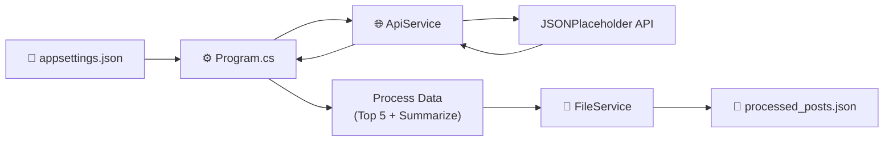
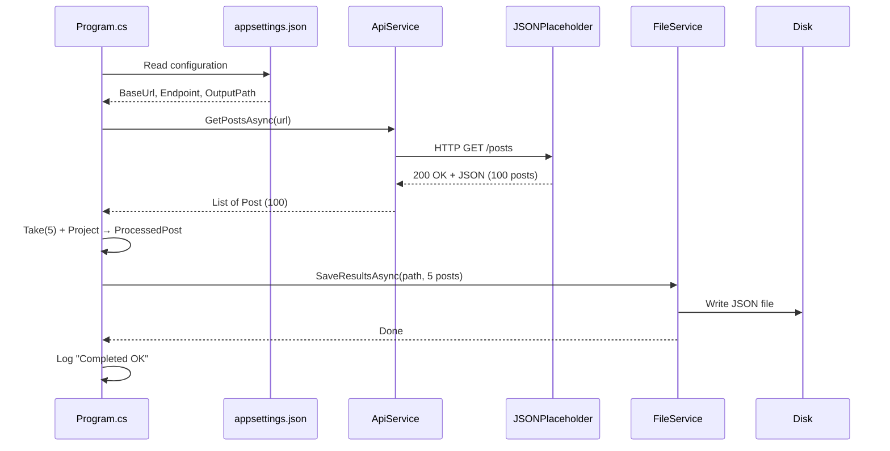

# RealDataServiceDemo — Complete Walkthrough

## What This App Does

**RealDataServiceDemo** is a .NET 10 console application that demonstrates how real-world .NET backend services work. It follows production patterns while staying beginner-friendly.

The full execution flow:



---

## Project Structure

```
RealDataServiceDemo/
├── Program.cs                  ← Entry point & orchestration
├── appsettings.json            ← Configuration (URLs, paths, logging)
├── RealDataServiceDemo.csproj  ← Project file with NuGet references
├── Models/
│   ├── Post.cs                 ← API response model
│   └── ProcessedPost.cs        ← Simplified output model
├── Services/
│   ├── ApiService.cs           ← HTTP client & JSON deserialization
│   └── FileService.cs          ← File serialization & disk I/O
└── Output/
    └── processed_posts.json    ← Generated at runtime
```

---

## NuGet Packages Used

| Package | Purpose |
|---------|---------|
| `Microsoft.Extensions.Configuration` | Core configuration abstraction |
| `Microsoft.Extensions.Configuration.Json` | Read `appsettings.json` files |
| `Microsoft.Extensions.Logging` | Structured logging framework |
| `Microsoft.Extensions.Logging.Console` | Console log output provider |

> **📝 Note:** `System.Text.Json` ships with .NET 10 — no extra package needed for JSON serialization.

---

## CLI Commands to Reproduce

```powershell
# 1. Create the project
dotnet new console -n RealDataServiceDemo -o . --framework net10.0

# 2. Add NuGet packages
dotnet add package Microsoft.Extensions.Configuration --prerelease
dotnet add package Microsoft.Extensions.Configuration.Json --prerelease
dotnet add package Microsoft.Extensions.Logging --prerelease
dotnet add package Microsoft.Extensions.Logging.Console --prerelease

# 3. Build
dotnet build

# 4. Run
dotnet run
```

---

## File-by-File Explanation

### 1. `appsettings.json` — Configuration

📄 File: [appsettings.json](appsettings.json)

**Purpose:** Externalizes all configurable values so you never hard-code URLs or file paths.

Key settings:
- **`ApiSettings:BaseUrl`** — The root URL of the API
- **`ApiSettings:PostsEndpoint`** — The specific endpoint path
- **`OutputSettings:OutputFilePath`** — Where to save processed results
- **`Logging:LogLevel`** — Controls log verbosity

> **💡 Tip:** In production, you'd have `appsettings.Development.json` and `appsettings.Production.json` for environment-specific overrides.

---

### 2. `Models/Post.cs` — API Response Model

📄 File: [Post.cs](Models/Post.cs)

**Purpose:** A strongly typed C# class that maps 1:1 to the JSON returned by JSONPlaceholder.

Key concept: `[JsonPropertyName("userId")]` tells `System.Text.Json` how to match the camelCase JSON keys to PascalCase C# properties.

```json
{ "userId": 1, "id": 1, "title": "...", "body": "..." }
```
↕ maps to ↕
```csharp
public int UserId { get; set; }
public int Id { get; set; }
public string Title { get; set; }
public string Body { get; set; }
```

---

### 3. `Models/ProcessedPost.cs` — Output Model

📄 File: [ProcessedPost.cs](Models/ProcessedPost.cs)

**Purpose:** A simplified "view model" used for the output file. In real apps, you rarely save raw API data directly — you transform it first.

Fields: `Id`, `Title`, and `Summary` (a truncated version of the body).

---

### 4. `Services/ApiService.cs` — HTTP Communication

📄 File: [ApiService.cs](Services/ApiService.cs)

**Purpose:** Handles all HTTP communication with the remote API.

What it does:
1. Creates an `HttpClient` instance
2. Sends an async GET request
3. Validates the response with `EnsureSuccessStatusCode()`
4. Deserializes JSON → `List<Post>` using `ReadFromJsonAsync<T>()`
5. Logs every step

> **⚠️ Important:** In production, you'd use `IHttpClientFactory` instead of `new HttpClient()` to avoid socket exhaustion. This demo keeps it simple intentionally.

---

### 5. `Services/FileService.cs` — File Output

📄 File: [FileService.cs](Services/FileService.cs)

**Purpose:** Serializes processed data to formatted JSON and writes it to disk.

Key behaviors:
- **Creates the output directory** if it doesn't exist
- **Uses `WriteIndented = true`** for human-readable JSON
- **Writes asynchronously** with `File.WriteAllTextAsync()`

---

### 6. `Program.cs` — Entry Point & Orchestrator

📄 File: [Program.cs](Program.cs)

**Purpose:** The "glue" that connects configuration, services, and business logic.

Execution steps:

| Step | What Happens |
|------|-------------|
| 1 | Build `IConfiguration` from `appsettings.json` |
| 2 | Create `ILoggerFactory` with console output |
| 3 | Read API URL and output path from config |
| 4 | Call `ApiService.GetPostsAsync()` |
| 5 | Take first 5 posts, project into `ProcessedPost` |
| 6 | Call `FileService.SaveResultsAsync()` |
| 7 | Log success or catch/log errors |

The data processing logic:
```csharp
List<ProcessedPost> processedPosts = allPosts
    .Take(5)
    .Select(post => new ProcessedPost
    {
        Id = post.Id,
        Title = post.Title,
        Summary = post.Body.Length > 80
            ? $"{post.Body[..80].ReplaceLineEndings(" ")}..."
            : post.Body.ReplaceLineEndings(" ")
    })
    .ToList();
```

---

## Expected Console Output

```
info: Program[0]
      ========================================
info: Program[0]
        RealDataServiceDemo — Starting
info: Program[0]
      ========================================
info: Program[0]
      API URL      : https://jsonplaceholder.typicode.com/posts
info: Program[0]
      Output Path  : Output/processed_posts.json
info: RealDataServiceDemo.Services.ApiService[0]
      Sending GET request to https://jsonplaceholder.typicode.com/posts
info: RealDataServiceDemo.Services.ApiService[0]
      Received HTTP 200 from API
info: RealDataServiceDemo.Services.ApiService[0]
      Successfully deserialized 100 posts from API
info: Program[0]
      Total posts retrieved: 100
info: Program[0]
      Processed 5 posts for output
info: RealDataServiceDemo.Services.FileService[0]
      Preparing to save 5 processed posts to Output/processed_posts.json
info: RealDataServiceDemo.Services.FileService[0]
      Created output directory: Output
info: RealDataServiceDemo.Services.FileService[0]
      Successfully saved output to Output/processed_posts.json
info: Program[0]
      ========================================
info: Program[0]
        RealDataServiceDemo — Completed OK
info: Program[0]
      ========================================
```

---

## Expected Output File (`Output/processed_posts.json`)

```json
[
  {
    "id": 1,
    "title": "sunt aut facere repellat provident occaecati excepturi optio reprehenderit",
    "summary": "quia et suscipit suscipit recusandae consequuntur expedita et cum reprehenderit ..."
  },
  {
    "id": 2,
    "title": "qui est esse",
    "summary": "est rerum tempore vitae sequi sint nihil reprehenderit dolor beatae ea dolores n..."
  },
  {
    "id": 3,
    "title": "ea molestias quasi exercitationem repellat qui ipsa sit aut",
    "summary": "et iusto sed quo iure voluptatem occaecati omnis eligendi aut ad voluptatem dolo..."
  },
  {
    "id": 4,
    "title": "eum et est occaecati",
    "summary": "ullam et saepe reiciendis voluptatem adipisci sit amet autem assumenda provident..."
  },
  {
    "id": 5,
    "title": "nesciunt quas odio",
    "summary": "repudiandae veniam quaerat sunt sed alias aut fugiat sit autem sed est voluptate..."
  }
]
```

---

## How It All Fits Together



---

## Optional Improvements (Future Enhancements)

### 1. Use `IHttpClientFactory` for Connection Pooling
Replace `new HttpClient()` with the factory pattern to properly manage socket connections. This prevents port exhaustion in long-running or high-throughput applications.

### 2. Add Retry Logic with Polly
Real APIs can return transient errors (HTTP 503, timeouts). Integrate the [Polly](https://github.com/App-vNext/Polly) library to add automatic retries with exponential backoff.

### 3. Add a Command-Line Argument for the Endpoint
Use `System.CommandLine` to let users choose which API resource to fetch (posts, users, comments) without editing `appsettings.json`:
```powershell
dotnet run -- --resource users
```

---

> **💡 Tip:** This project uses the same configuration and logging patterns as ASP.NET Core. Mastering them here transfers directly to web API development.
